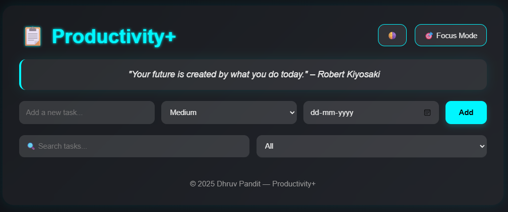
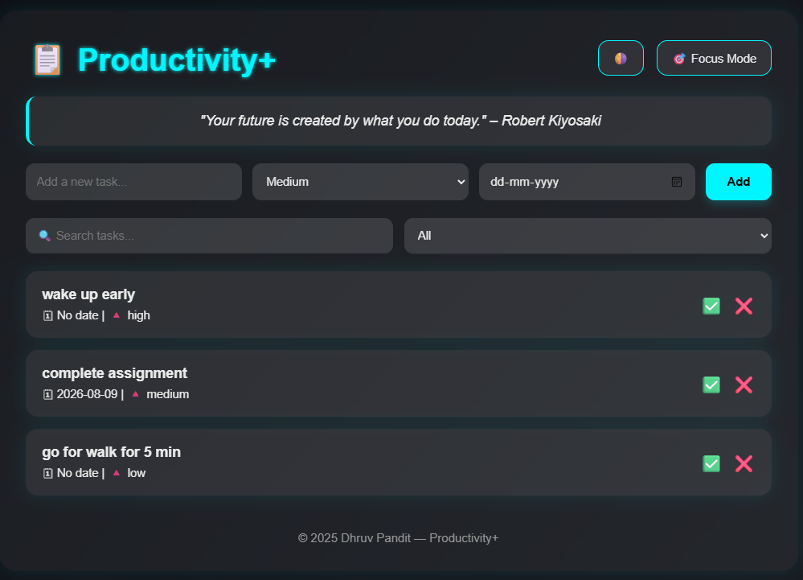
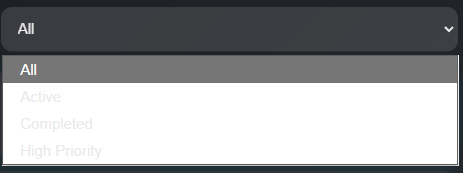
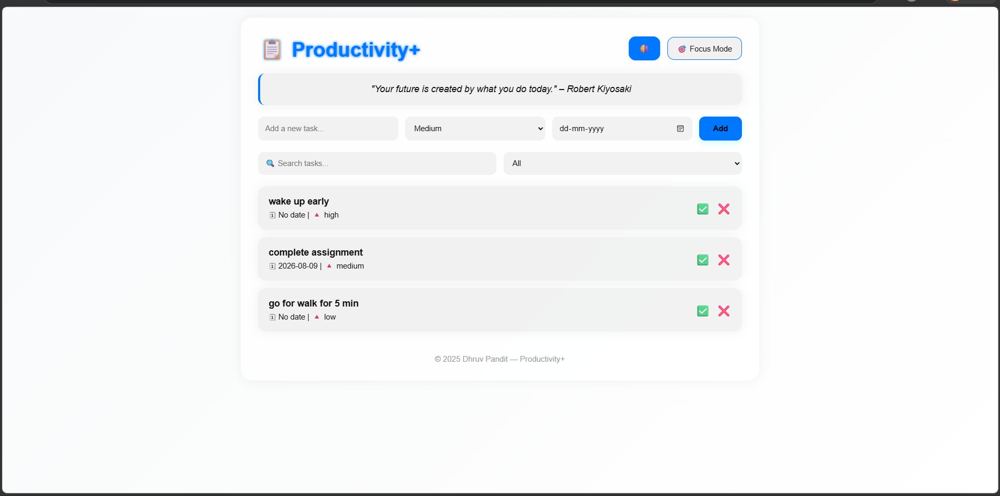

# 📝 ToDoList V2 — Productivity+


**ToDoList V2** is an advanced browser-based productivity and task management application built with **HTML, CSS, and vanilla JavaScript**.

Compared with a basic to-do list, this version introduces **task priorities, due dates, search, filtering, completion tracking, focus mode, motivational quotes, theme switching, and persistent browser storage** in a lightweight frontend application.

No backend or database is required.

---

# 📑 Table of Contents

- Features
- Screenshots
- Live Demo
- Technologies
- Project Structure
- How It Works
- Task Management
- Search & Filtering
- Focus Mode
- Theme System
- Data Persistence
- Installation
- Future Improvements
- Contributing
- License
- Author
- Support

---

# ✨ Features

✅ Create New Tasks

✅ Delete Tasks

✅ Mark Tasks as Completed

✅ Task Priority Levels

✅ Low / Medium / High Priority

✅ Due Date Support

✅ Search Tasks

✅ Filter Tasks

✅ All Tasks Filter

✅ Active Tasks Filter

✅ Completed Tasks Filter

✅ High Priority Filter

✅ Focus Mode

✅ Random Motivational Quotes

✅ Dark Theme

✅ Light Theme

✅ Persistent Theme Preference

✅ LocalStorage Persistence

✅ Responsive Layout

✅ Glassmorphism UI

✅ Smooth Animations

✅ No Backend Required

✅ No Framework Required

---

# 📸 Screenshots

## 🏠 Productivity Dashboard

<p align="center">

</p>

---

## 📝 Task Management

<p align="center">

</p>

---

## 🔎 Search & Filtering

<p align="center">

</p>

---

## 🌙 Dark & Light Themes

<p align="center">

</p>

---

# 🚀 Live Demo

https://dhruvpandit46.github.io/ToDoList-V2/

---

# ⚙ Technologies Used

- HTML5
- CSS3
- JavaScript (ES6)
- DOM Manipulation
- LocalStorage
- CSS Variables
- CSS Backdrop Filter
- Responsive CSS
- Browser APIs

---

# 📂 Project Structure

```text
ToDoList-V2/
│
├── index.html
├── style.css
├── script.js
├── images/
└── README.md
```

---

# ⚡ How It Works

The application is completely client-side.

```text
User
 │
 ▼
Task Input
 │
 ├── Task Name
 ├── Priority
 └── Due Date
 │
 ▼
JavaScript
 │
 ├── Add Task
 ├── Render Task
 ├── Search / Filter
 ├── Complete Task
 └── Delete Task
 │
 ▼
LocalStorage
```

Tasks are stored in the browser and restored automatically when the application is opened again.

---

# 📝 Task Management

Each task contains:

```text
Task
├── Text
├── Priority
├── Due Date
└── Completion Status
```

### Priority Levels

The application supports three priority levels:

- 🔽 Low
- 🔶 Medium
- 🔺 High

New tasks default to **Medium** priority.

---

# 🔎 Search & Filtering

The application includes real-time task searching.

Users can search tasks using the search field, while the filter system provides:

```text
All
Active
Completed
High Priority
```

Search and filtering work together, allowing users to quickly locate specific tasks.

---

# ✅ Task Completion

Tasks can be marked as completed using the completion button.

Completed tasks receive a visual indication through the `.done` state, including:

- Strikethrough task text
- Completion color
- Updated completion state in LocalStorage

Tasks can also be marked incomplete again.

---

# 🎯 Focus Mode

Focus Mode provides a simplified task view.

When enabled, the application limits the displayed task list to the first matching task.

This creates a minimal workspace for concentrating on one task at a time.

---

# 💬 Motivational Quotes

The application includes a collection of motivational productivity quotes.

A random quote is selected when the application loads.

Example:

> "Focus on being productive instead of busy." – Tim Ferriss

Other included quotes feature:

- Nelson Mandela
- Sam Levenson
- Robert Kiyosaki
- Stephen Covey

---

# 🌓 Theme System

ToDoList V2 supports both dark and light themes.

### Dark Theme

The default interface uses:

- Dark gradient background
- Glassmorphic cards
- Cyan accent color
- High-contrast text

### Light Theme

The light theme switches the CSS variables to a brighter interface.

The selected theme is stored in LocalStorage so the preference can be restored on future visits.

---

# 💾 LocalStorage

The application uses the browser's **LocalStorage API** for persistence.

Tasks are stored as serialized JSON:

```javascript
localStorage.setItem("tasks", JSON.stringify(tasks));
```

The selected theme is also stored locally:

```javascript
localStorage.setItem("theme", theme);
```

This allows the application to preserve:

- Tasks
- Priority values
- Due dates
- Completion status
- Theme preference

No external database is required.

---

# 🧠 Core JavaScript Functions

The main application logic is organized around several functions:

```text
renderTasks()
addTask()
deleteTask()
toggleDone()
saveTasks()
toggleFocusMode()
toggleTheme()
loadTheme()
getRandomQuote()
```

### `addTask()`

Creates a new task with its text, priority, due date, and completion state.

### `renderTasks()`

Updates the task list based on the current search term, filter, and focus mode.

### `toggleDone()`

Switches a task between completed and active states.

### `deleteTask()`

Removes a task after confirmation.

### `saveTasks()`

Persists the current task list in LocalStorage.

### `toggleTheme()`

Switches between dark and light themes.

### `loadTheme()`

Restores the previously selected theme.

---

# 🎨 UI Highlights

- Glassmorphism design
- Dark futuristic interface
- Cyan accent system
- CSS variable-based theming
- Responsive task controls
- Smooth fade-in animations
- Task slide-up animations
- Rounded task cards
- Minimal productivity-focused layout

---

# 📦 Installation

Clone the repository:

```bash
git clone https://github.com/dhruvpandit46/ToDoList-V2.git
```

Go inside the project:

```bash
cd ToDoList-V2
```

Open:

```text
index.html
```

in your browser.

No dependencies or package installation are required.

---

# 🎯 Future Improvements

- Task editing
- Drag-and-drop task ordering
- Recurring tasks
- Task categories
- Subtasks
- Notifications and reminders
- Automatic overdue detection
- Calendar integration
- Task statistics
- Productivity analytics
- Export and import tasks
- Cloud synchronization
- Firebase integration
- User accounts
- PWA support
- Offline installation

---

# 🤝 Contributing

Contributions are welcome.

1. Fork the repository

2. Create your feature branch:

```bash
git checkout -b feature/new-feature
```

3. Commit your changes:

```bash
git commit -m "Add new feature"
```

4. Push your branch:

```bash
git push origin feature/new-feature
```

5. Open a Pull Request.

---

# 📜 License

Licensed under the **MIT License**.

MIT © 2026 Dhruv Pandit.

See the [LICENSE](LICENSE) file for full license details.

---

# 👨‍💻 Author

**Dhruv Pandit**

GitHub

https://github.com/dhruvpandit46

LinkedIn

https://linkedin.com/in/dhruv-pandit-755786326

Instagram

https://instagram.com/dhruv_pandit2007

---

# ⭐ Support

If you found this project useful,

please consider giving it a ⭐ on GitHub.

It helps support future development.
